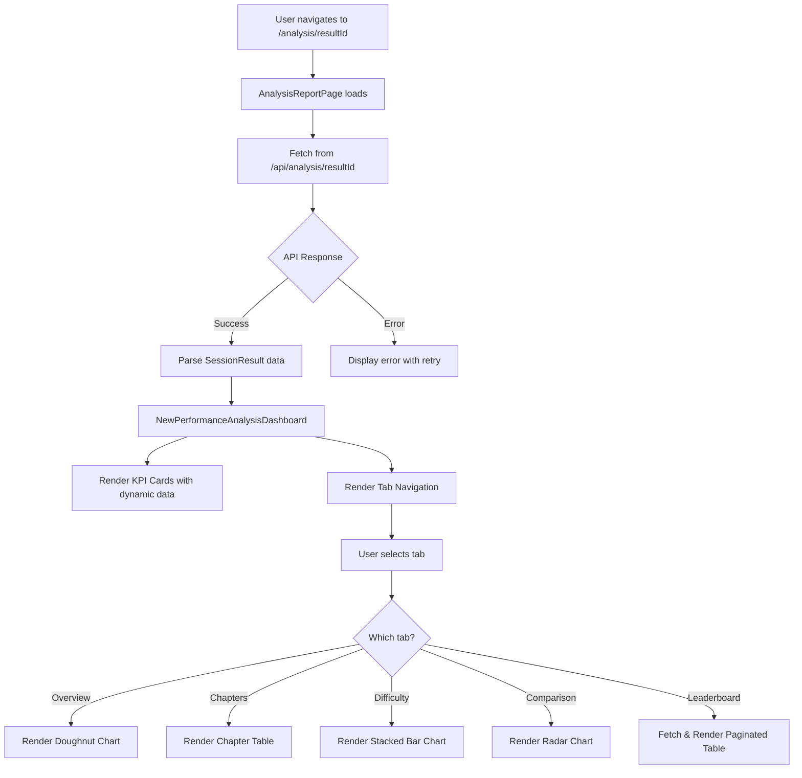

# Design Document

## Overview

The Next-Gen Performance Analysis page is a complete redesign of the existing analysis dashboard, implementing a modern glassmorphic UI with comprehensive data visualizations. The design follows a pixel-perfect replication approach, where the UI specification in `NewAnalysisPageDesignUIOnly.txt` serves as the definitive source of truth for all visual elements, component structures, and interactions.

### Design Principles

1. **Pixel-Perfect Replication**: All UI components must match the specifications in NewAnalysisPageDesignUIOnly.txt exactly
2. **Dynamic Data Integration**: Replace all hardcoded values with data from existing backend APIs
3. **No Logic Reimplementation**: Use existing calculation logic from the backend; only connect data to UI
4. **Responsive First**: Maintain the responsive grid layouts and breakpoints defined in the source file
5. **Performance Optimized**: Use React best practices for chart rendering and pagination

## Architecture

### Component Hierarchy

```
AnalysisReportPage (src/app/analysis/[resultId]/page.tsx)
├── PerformanceAnalysisSkeletonLoader (loading state)
├── Error Display (error state)
└── NewPerformanceAnalysisDashboard (main component)
    ├── Header Section
    │   ├── Title and Timestamp
    │   └── View Solution Button
    ├── KPI Dashboard Section
    │   ├── KpiCard (Score) - Primary
    │   ├── KpiCard (Rank) - Primary
    │   ├── KpiCard (Percentile) - Primary
    │   ├── KpiCard (Accuracy) - Primary
    │   ├── KpiCard (Time Taken) - Primary
    │   ├── AttemptSummaryCard (Correct/Incorrect/Skipped)
    │   ├── KpiCard (Attempt Rate)
    │   └── KpiCard (Total Questions)
    └── Tabbed Analysis Section
        ├── Tab Navigation
        │   ├── Overview Tab
        │   ├── Chapter-wise Tab
        │   ├── Difficulty Tab
        │   ├── Topper Comparison Tab
        │   └── Leaderboard Tab
        └── Tab Panels
            ├── OverviewPanel (Doughnut Chart)
            ├── ChapterPanel (Table with Progress Bars)
            ├── DifficultyPanel (Stacked Bar Chart)
            ├── ComparisonPanel (Radar Chart)
            └── LeaderboardPanel (Paginated Table)
```

### Data Flow



## Components and Interfaces

### 1. NewPerformanceAnalysisDashboard Component

**Location**: `src/components/NewPerformanceAnalysisDashboard.tsx`

**Purpose**: Main container component that orchestrates the entire analysis dashboard

**Props Interface**:
```typescript
interface NewPerformanceAnalysisDashboardProps {
  sessionResult: SessionResult
  onNavigateToSolutions?: () => void
  className?: string
}
```

**Key Responsibilities**:
- Render header with timestamp and View Solution button
- Display 8 KPI cards in responsive grid
- Manage tab state and navigation
- Coordinate data flow to child components

**Styling**: 
- Container: `max-w-7xl mx-auto`
- Background: Applied at page level, not component level
- Uses glassmorphism effects from NewAnalysisPageDesignUIOnly.txt

### 2. KpiCard Component

**Location**: `src/components/KpiCard.tsx` (new file)

**Purpose**: Reusable card component for displaying key performance indicators

**Props Interface**:
```typescript
interface KpiCardProps {
  title: string
  value: string
  subtext: string
  icon: LucideIcon
  isPrimary?: boolean
}
```

**Styling Classes** (from NewAnalysisPageDesignUIOnly.txt):
- Base: `glass-card group kpi-card lg:col-span-1`
- Primary variant: `border-2 border-indigo-200`
- Title colors: `text-indigo-800` (primary) or `text-slate-700`
- Value colors: `text-indigo-600` (primary) or `text-slate-800`
- Icon positioning: Absolute, right: -1.5rem, bottom: -1rem

**Dynamic Data Mapping**:
- Score: `${sessionResult.testResult.results.marks_obtained}` / `${sessionResult.testResult.results.total_marks}`
- Rank: `#${sessionResult.testResult.results.rank}` / `${sessionResult.testResult.results.total_test_takers}`
- Percentile: `${sessionResult.testResult.results.percentile.toFixed(1)}%`
- Accuracy: Calculate from `total_correct / (total_correct + total_incorrect) * 100`
- Time Taken: Format `total_time_taken` to HH:MM

### 3. AttemptSummaryCard Component

**Location**: `src/components/AttemptSummaryCard.tsx` (new file)

**Purpose**: Specialized card showing correct/incorrect/skipped breakdown

**Props Interface**:
```typescript
interface AttemptSummaryCardProps {
  correct: number
  incorrect: number
  skipped: number
}
```

**Styling**: 
- Container: `glass-card group kpi-card col-span-2 sm:col-span-3 lg:col-span-2`
- Grid: `mt-4 grid grid-cols-3 gap-4`
- Colors: indigo-600 (correct), amber-600 (incorrect), slate-600 (skipped)

**Dynamic Data**: 
- Correct: `sessionResult.testResult.total_correct`
- Incorrect: `sessionResult.testResult.total_incorrect`
- Skipped: `sessionResult.testResult.total_skipped`

### 4. OverviewPanel Component

**Location**: `src/components/OverviewPanel.tsx` (new file)

**Purpose**: Displays doughnut chart showing question breakdown

**Props Interface**:
```typescript
interface OverviewPanelProps {
  correct: number
  incorrect: number
  skipped: number
}
```

**Chart Configuration**:
- Type: Doughnut (from react-chartjs-2)
- Data: `[correct, incorrect, skipped]`
- Colors: 
  - Correct: `rgba(79, 70, 229, 0.7)` / `#4f46e5`
  - Incorrect: `rgba(217, 119, 6, 0.7)` / `#d97706`
  - Skipped: `rgba(100, 116, 139, 0.7)` / `#64748b`
- Height: `h-64 md:h-80`
- Legend: Custom, positioned below chart

### 5. ChapterPanel Component

**Location**: `src/components/ChapterPanel.tsx` (new file)

**Purpose**: Displays chapter-wise performance in table format

**Props Interface**:
```typescript
interface ChapterPerformance {
  name: string
  totalQuestions: number
  accuracy: number
  correct: number
  incorrect: number
  avgTimePerQuestion: number // in seconds
}

interface ChapterPanelProps {
  chapters: ChapterPerformance[]
}
```

**Data Calculation Logic**:
```typescript
// Group answer log by chapter
const chapterMap = new Map<string, {
  correct: number
  incorrect: number
  skipped: number
  totalTime: number
}>()

sessionResult.answerLog.forEach(answer => {
  const question = sessionResult.questions.find(q => q.id === answer.question_id)
  if (!question) return
  
  const chapter = question.chapter_name
  if (!chapterMap.has(chapter)) {
    chapterMap.set(chapter, { correct: 0, incorrect: 0, skipped: 0, totalTime: 0 })
  }
  
  const stats = chapterMap.get(chapter)!
  if (answer.status === 'correct') stats.correct++
  else if (answer.status === 'incorrect') stats.incorrect++
  else stats.skipped++
  stats.totalTime += answer.time_taken
})

// Convert to ChapterPerformance array
const chapters: ChapterPerformance[] = Array.from(chapterMap.entries()).map(([name, stats]) => {
  const attempted = stats.correct + stats.incorrect
  const accuracy = attempted > 0 ? (stats.correct / attempted) * 100 : 0
  const avgTime = attempted > 0 ? stats.totalTime / attempted : 0
  
  return {
    name,
    totalQuestions: stats.correct + stats.incorrect + stats.skipped,
    accuracy,
    correct: stats.correct,
    incorrect: stats.incorrect,
    avgTimePerQuestion: avgTime
  }
})
```

**Progress Bar Gradient Logic**:
```typescript
const getGradient = (accuracy: number): string => {
  if (accuracy >= 85) return 'linear-gradient(to right, #2dd4bf, #0d9488)' // teal
  if (accuracy >= 60) return 'linear-gradient(to right, #fbbf24, #d97706)' // yellow-amber
  return 'linear-gradient(to right, #f87171, #dc2626)' // red
}
```

### 6. DifficultyPanel Component

**Location**: `src/components/DifficultyPanel.tsx` (new file)

**Purpose**: Displays stacked bar chart for difficulty-wise performance

**Props Interface**:
```typescript
interface DifficultyBreakdown {
  easy: { correct: number; incorrect: number; skipped: number }
  medium: { correct: number; incorrect: number; skipped: number }
  hard: { correct: number; incorrect: number; skipped: number }
}

interface DifficultyPanelProps {
  breakdown: DifficultyBreakdown
}
```

**Data Calculation Logic**:
```typescript
const breakdown: DifficultyBreakdown = {
  easy: { correct: 0, incorrect: 0, skipped: 0 },
  medium: { correct: 0, incorrect: 0, skipped: 0 },
  hard: { correct: 0, incorrect: 0, skipped: 0 }
}

sessionResult.answerLog.forEach(answer => {
  const question = sessionResult.questions.find(q => q.id === answer.question_id)
  if (!question || !question.difficulty) return
  
  // Map difficulty levels
  let level: 'easy' | 'medium' | 'hard'
  if (question.difficulty === 'Easy' || question.difficulty === 'Easy-Moderate') {
    level = 'easy'
  } else if (question.difficulty === 'Moderate' || question.difficulty === 'Moderate-Hard') {
    level = 'medium'
  } else {
    level = 'hard'
  }
  
  if (answer.status === 'correct') breakdown[level].correct++
  else if (answer.status === 'incorrect') breakdown[level].incorrect++
  else breakdown[level].skipped++
})
```

**Chart Configuration**:
- Type: Bar (stacked)
- Labels: `['Easy', 'Medium', 'Hard']`
- Datasets: 3 (Correct, Incorrect, Skipped)
- Stacked: Both x and y axes
- Height: `h-80 md:h-96`

### 7. ComparisonPanel Component

**Location**: `src/components/ComparisonPanel.tsx` (new file)

**Purpose**: Displays radar chart comparing user vs topper performance

**Props Interface**:
```typescript
interface ComparisonData {
  labels: string[] // Chapter names + 'Overall'
  userScores: number[] // Accuracy percentages
  topperScores: number[] // Accuracy percentages
}

interface ComparisonPanelProps {
  comparisonData: ComparisonData | null
}
```

**Data Calculation Logic**:
```typescript
// This data should come from the backend API's topperComparison field
// If not available, calculate from sessionResult and topperResult

const calculateComparison = (): ComparisonData | null => {
  if (!sessionResult.topperResult) return null
  
  // Get unique chapters
  const chapters = Array.from(new Set(
    sessionResult.questions.map(q => q.chapter_name)
  ))
  
  const userScores: number[] = []
  const topperScores: number[] = []
  
  chapters.forEach(chapter => {
    // Calculate user accuracy for chapter
    const userChapterAnswers = sessionResult.answerLog.filter(a => {
      const q = sessionResult.questions.find(q => q.id === a.question_id)
      return q?.chapter_name === chapter
    })
    const userCorrect = userChapterAnswers.filter(a => a.status === 'correct').length
    const userAttempted = userChapterAnswers.filter(a => a.status !== 'skipped').length
    const userAccuracy = userAttempted > 0 ? (userCorrect / userAttempted) * 100 : 0
    userScores.push(userAccuracy)
    
    // Calculate topper accuracy for chapter
    const topperChapterAnswers = sessionResult.topperResult.answerLog.filter(a => {
      const q = sessionResult.questions.find(q => q.id === a.question_id)
      return q?.chapter_name === chapter
    })
    const topperCorrect = topperChapterAnswers.filter(a => a.status === 'correct').length
    const topperAttempted = topperChapterAnswers.filter(a => a.status !== 'skipped').length
    const topperAccuracy = topperAttempted > 0 ? (topperCorrect / topperAttempted) * 100 : 0
    topperScores.push(topperAccuracy)
  })
  
  // Add overall accuracy
  const userOverall = sessionResult.testResult.accuracy || 0
  const topperOverall = sessionResult.topperResult.testResult.accuracy || 0
  userScores.push(userOverall)
  topperScores.push(topperOverall)
  
  return {
    labels: [...chapters, 'Overall'],
    userScores,
    topperScores
  }
}
```

**Chart Configuration**:
- Type: Radar
- Datasets: 2 (You, Topper)
- Colors: 
  - You: `rgba(79, 70, 229, 0.7)` / `#4f46e5` (indigo)
  - Topper: `rgba(20, 184, 166, 0.7)` / `#14b8a6` (teal)
- Scale: 0-100
- Height: `h-80 md:h-96`

### 8. LeaderboardPanel Component

**Location**: `src/components/LeaderboardPanel.tsx` (new file)

**Purpose**: Displays paginated leaderboard with user highlighting

**Props Interface**:
```typescript
interface LeaderboardEntry {
  rank: number
  userId: string
  name: string // 'You' for current user, otherwise anonymized
  score: number
  totalMarks: number
  correct: number
  incorrect: number
  skipped: number
  timeTaken: number // in seconds
  isCurrentUser: boolean
}

interface LeaderboardPanelProps {
  testId: number | null
  currentUserId: string
}
```

**Data Fetching**:
```typescript
// Fetch from new API endpoint: /api/analysis/leaderboard/[testId]
// Query params: page, limit (10 per page)
// Response should include:
// - entries: LeaderboardEntry[]
// - totalEntries: number
// - currentUserRank: number
```

**Pagination Hook** (from NewAnalysisPageDesignUIOnly.txt):
```typescript
const usePagination = ({ totalPages, currentPage, siblingCount = 1 }) => {
  const paginationRange = useMemo(() => {
    const totalPageNumbersToShow = siblingCount + 5
    
    if (totalPages <= totalPageNumbersToShow) {
      return Array.from({ length: totalPages }, (_, i) => i + 1)
    }
    
    const leftSiblingIndex = Math.max(currentPage - siblingCount, 1)
    const rightSiblingIndex = Math.min(currentPage + siblingCount, totalPages)
    
    const shouldShowLeftDots = leftSiblingIndex > 2
    const shouldShowRightDots = rightSiblingIndex < totalPages - 1
    
    const firstPageIndex = 1
    const lastPageIndex = totalPages
    
    if (!shouldShowLeftDots && shouldShowRightDots) {
      let leftItemCount = 3 + 2 * siblingCount
      let leftRange = Array.from({ length: leftItemCount }, (_, i) => i + 1)
      return [...leftRange, DOTS, totalPages]
    }
    
    if (shouldShowLeftDots && !shouldShowRightDots) {
      let rightItemCount = 3 + 2 * siblingCount
      let rightRange = Array.from({ length: rightItemCount }, (_, i) => totalPages - rightItemCount + i + 1)
      return [firstPageIndex, DOTS, ...rightRange]
    }
    
    if (shouldShowLeftDots && shouldShowRightDots) {
      let middleRange = Array.from({ length: rightSiblingIndex - leftSiblingIndex + 1 }, (_, i) => leftSiblingIndex + i)
      return [firstPageIndex, DOTS, ...middleRange, DOTS, lastPageIndex]
    }
    
    return Array.from({ length: totalPages }, (_, i) => i + 1)
  }, [totalPages, currentPage, siblingCount])
  
  return paginationRange || []
}
```

### 9. Global Styles

**Location**: Injected via useEffect in NewPerformanceAnalysisDashboard

**CSS Classes** (from NewAnalysisPageDesignUIOnly.txt):
```css
.glass-card {
  background: rgba(255, 255, 255, 0.6);
  backdrop-filter: blur(12px) saturate(180%);
  -webkit-backdrop-filter: blur(12px) saturate(180%);
  border: 1px solid rgba(226, 232, 240, 0.8);
  border-radius: 1rem;
  box-shadow: 0 8px 32px 0 rgba(31, 38, 135, 0.1);
  transition: all 0.3s ease;
}

.glass-card:hover {
  transform: translateY(-5px);
  box-shadow: 0 12px 32px 0 rgba(31, 38, 135, 0.15);
}

.kpi-card {
  position: relative;
  overflow: hidden;
  padding: 1.5rem;
}

.kpi-card-icon {
  position: absolute;
  right: -1.5rem;
  bottom: -1rem;
  font-size: 6rem;
  color: rgba(100, 116, 139, 0.08);
  line-height: 1;
  transition: all 0.3s ease;
}

.kpi-card.group:hover .kpi-card-icon {
  color: rgba(100, 116, 139, 0.12);
  transform: rotate(-5deg) scale(1.05);
}

::-webkit-scrollbar {
  width: 8px;
  height: 8px;
}

::-webkit-scrollbar-track {
  background: #e2e8f0;
  border-radius: 10px;
}

::-webkit-scrollbar-thumb {
  background: #94a3b8;
  border-radius: 10px;
}

::-webkit-scrollbar-thumb:hover {
  background: #64748b;
}

.tab-btn {
  transition: all 0.2s ease-in-out;
}

.tab-btn.active {
  border-color: #4f46e5;
  color: #4f46e5;
  font-weight: 600;
}
```

## Data Models

### SessionResult (Existing)

```typescript
interface SessionResult {
  testResult: TestResultRow & { 
    results: {
      marks_obtained: number
      total_marks: number
      percentile: number
      rank: number
      total_test_takers: number
    }
  }
  answerLog: AnswerLogRow[]
  questions: QuestionRow[]
  topperResult?: {
    testResult: TestResultRow & { results: PerformanceMetrics }
    answerLog: AnswerLogRow[]
  }
  leaderboard?: any[]
}
```

### New API Response for Leaderboard

```typescript
interface LeaderboardResponse {
  entries: LeaderboardEntry[]
  totalEntries: number
  currentUserRank: number
  currentPage: number
  totalPages: number
}
```

## Error Handling

### Error States

1. **API Fetch Error**
   - Display: Error message with retry button
   - Styling: Red text, centered layout
   - Action: Retry button calls fetchData() again

2. **No Data Available**
   - Display: "No analysis data found for this result."
   - Styling: Slate text, centered layout
   - Action: None (terminal state)

3. **Chart Rendering Error**
   - Fallback: Display text-based summary
   - Log: Console error for debugging
   - Action: Continue rendering other components

4. **Leaderboard Fetch Error**
   - Display: Error message within leaderboard tab
   - Action: Retry button specific to leaderboard

### Loading States

1. **Initial Page Load**
   - Component: PerformanceAnalysisSkeletonLoader
   - Duration: Until API response received
   - Layout: Matches final dashboard structure

2. **Leaderboard Pagination**
   - Indicator: Disabled pagination buttons
   - Duration: During page change API call
   - Fallback: Show previous page data

## Testing Strategy

### Unit Tests

1. **KpiCard Component**
   - Test: Renders with correct props
   - Test: Applies primary styling when isPrimary=true
   - Test: Icon renders correctly

2. **usePagination Hook**
   - Test: Returns correct range for small page counts
   - Test: Shows dots for large page counts
   - Test: Handles edge cases (page 1, last page)

3. **Data Calculation Functions**
   - Test: Chapter performance calculation
   - Test: Difficulty breakdown calculation
   - Test: Accuracy percentage calculation
   - Test: Time formatting

### Integration Tests

1. **Dashboard Rendering**
   - Test: All KPI cards render with dynamic data
   - Test: Tab navigation works correctly
   - Test: Charts render with correct data

2. **API Integration**
   - Test: Successful data fetch and display
   - Test: Error handling and retry
   - Test: Loading state display

3. **Leaderboard Pagination**
   - Test: Initial page shows user's rank
   - Test: Page navigation works
   - Test: User row is highlighted

### Visual Regression Tests

1. **Glassmorphism Effects**
   - Verify: Card backgrounds and blur effects
   - Verify: Hover animations

2. **Responsive Layouts**
   - Test: Mobile (320px, 375px, 414px)
   - Test: Tablet (768px, 1024px)
   - Test: Desktop (1280px, 1920px)

3. **Chart Rendering**
   - Verify: Colors match specification
   - Verify: Legends display correctly
   - Verify: Responsive sizing

## Performance Considerations

### Optimization Strategies

1. **Chart.js Registration**
   - Register components once at module level
   - Avoid re-registration on re-renders

2. **Memoization**
   - useMemo for expensive calculations (chapter stats, difficulty breakdown)
   - useCallback for event handlers
   - React.memo for pure components (KpiCard, etc.)

3. **Lazy Loading**
   - Consider lazy loading chart libraries
   - Load leaderboard data only when tab is active

4. **Data Processing**
   - Process answer log data once, cache results
   - Avoid recalculating on every render

### Bundle Size

- Chart.js: ~200KB (necessary for visualizations)
- Lucide React: Tree-shakeable, only import used icons
- Total estimated addition: ~250KB gzipped

## Accessibility

### ARIA Labels

- Tab navigation: `role="tab"`, `aria-selected`, `aria-controls`
- Tab panels: `role="tabpanel"`, `aria-labelledby`
- Pagination: `aria-label` on prev/next buttons
- Charts: Provide text alternatives for screen readers

### Keyboard Navigation

- Tab through KPI cards
- Arrow keys for tab navigation
- Enter/Space to activate tabs
- Tab through pagination controls

### Color Contrast

- All text meets WCAA AA standards
- Chart colors have sufficient contrast
- Focus indicators visible on all interactive elements

## Migration Strategy

### Phase 1: Component Creation
- Create all new components in src/components/
- Extract and adapt styling from NewAnalysisPageDesignUIOnly.txt
- Implement with mock data for testing

### Phase 2: Data Integration
- Connect components to SessionResult data
- Implement calculation logic for derived metrics
- Test with real API responses

### Phase 3: API Enhancement
- Create leaderboard API endpoint
- Enhance topper comparison data if needed
- Optimize data fetching

### Phase 4: Replacement
- Update AnalysisReportPage to use NewPerformanceAnalysisDashboard
- Remove old PerformanceAnalysisDashboard component
- Update imports and references

### Phase 5: Testing & Polish
- Cross-browser testing
- Performance profiling
- Accessibility audit
- Visual regression testing

## Dependencies

### New Dependencies
```json
{
  "chart.js": "^4.4.0",
  "react-chartjs-2": "^5.2.0"
}
```

### Existing Dependencies (Verify Versions)
- lucide-react: For icons
- framer-motion: For animations (if used)
- next: For routing and API

## Design Decisions and Rationales

### 1. Why Separate Components?

**Decision**: Break down the monolithic component from NewAnalysisPageDesignUIOnly.txt into smaller, reusable components.

**Rationale**:
- Easier testing and maintenance
- Better code organization
- Reusability across the application
- Clearer separation of concerns

### 2. Why Inject Global Styles?

**Decision**: Use useEffect to inject CSS rather than a separate stylesheet.

**Rationale**:
- Matches the pattern in NewAnalysisPageDesignUIOnly.txt
- Ensures styles are scoped to this feature
- Easier cleanup when component unmounts
- Avoids global CSS conflicts

### 3. Why Client-Side Pagination for Leaderboard?

**Decision**: Fetch paginated data from server rather than loading all entries.

**Rationale**:
- Better performance for large leaderboards (1000+ users)
- Reduced initial load time
- Lower memory usage
- Scalable solution

### 4. Why Calculate Chapter Stats Client-Side?

**Decision**: Process answer log data in the browser rather than backend.

**Rationale**:
- Data already available in SessionResult
- Reduces API complexity
- Faster response times (no additional API call)
- Flexibility for future filtering/sorting

### 5. Why Use Existing Backend Logic?

**Decision**: Don't reimplement score, rank, percentile calculations.

**Rationale**:
- Avoid duplication and potential inconsistencies
- Backend calculations are already tested and proven
- Reduces implementation time
- Single source of truth for business logic

## Future Enhancements

### Potential Improvements

1. **Export Functionality**
   - PDF export of analysis report
   - CSV export of detailed results

2. **Comparison Features**
   - Compare with previous attempts
   - Compare with class average
   - Historical trend charts

3. **Interactive Filters**
   - Filter chapters by performance
   - Filter questions by difficulty
   - Custom date range selection

4. **Social Features**
   - Share achievements
   - Challenge friends
   - Study group comparisons

5. **AI Insights**
   - Personalized study recommendations
   - Weakness identification
   - Predicted improvement timeline

### Technical Debt Considerations

1. **Chart Library Evaluation**
   - Consider alternatives to Chart.js (Recharts, Victory)
   - Evaluate bundle size impact
   - Assess customization needs

2. **State Management**
   - Consider Context API for shared state
   - Evaluate need for Redux/Zustand
   - Optimize re-render patterns

3. **API Optimization**
   - Implement caching strategy
   - Consider GraphQL for flexible queries
   - Evaluate real-time updates (WebSockets)
